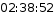
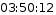
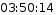
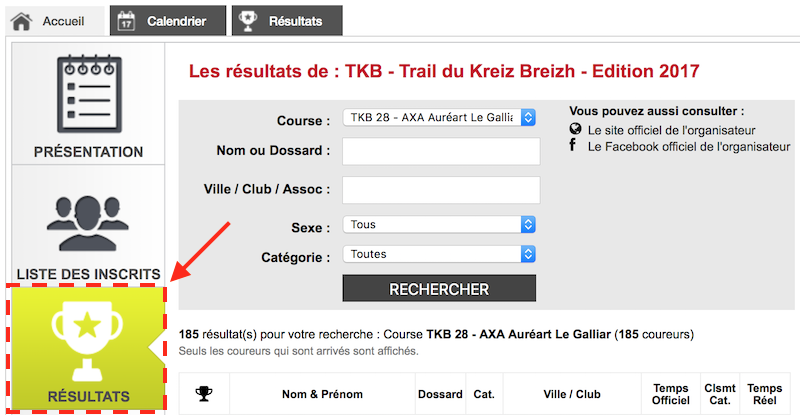
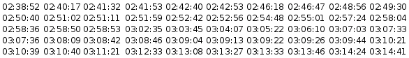
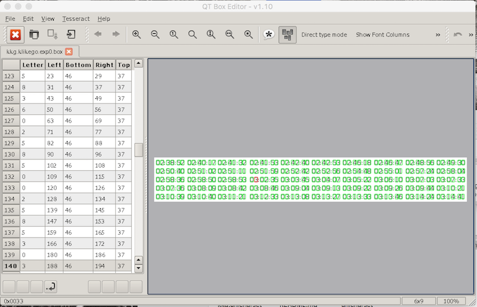

# Klikego Scraper

A set of tools and libraries to scrap results from [Klikego](https://www.klikego.com) web site.

**The original repository (containing source code) has been removed after abusive use of the tool by third parties was reported by [Klikego](https://www.klikego.com) administrator.**

## Introduction

[Klikego](https://www.klikego.com) is a nice and handy web site allowing:

- As an organization, to create a sport event and centralize registration, including online payment.
- As a competitor, to register to a race in few steps.

As of writing (27th of may 2017), Klikego supports running, walking, triathlon, cycling and tennis events.

As a newly converted [trail](https://en.wikipedia.org/wiki/Trail_running) runner, and long time data addict, I enjoy analyzing my races to compare my performance to other contenders.

Until now, I was manually collecting (i.e. by copy and paste and data wrangling in a text editor) results in order to manipulate them in **[R](https://cran.r-project.org)**, and publish reports to **[RPubs](http://rpubs.com/mcaradec)**.

Recently, Klikego changed its results page content, by rendering times as images instead of text:

- 
- 
- 

Manual collection was a bit cumbersome, but acceptable as far as it was possible to gather required data. From now, the copy and paste method became useless (as it doesn't include time information anymore).

This was an opportunity to fully automatize the process, from data collection to output standardization, including character recognition.

That's how the **Klikego Scraper** project started.

The project is written in **C#** language on [.Net Core](https://www.microsoft.com/net/core), a platform for creating applications that run on Windows, Linux and Mac.

[Visual Studio Code](https://code.visualstudio.com) editor was used.

Development was done on a [MacBook Pro](https://www.apple.com/fr/macbook-pro/).

## Setup

1. Install **.Net Core 2.0** or later by following instructions on [.Net Core web site](https://www.microsoft.com/net/core).
2. Optical Character Recognition is done using **[Tesseract](https://github.com/tesseract-ocr/tesseract)**, an Open Source OCR Engine. Install Tesseract **v3.05** or later by following instructions on [Wiki page](https://github.com/tesseract-ocr/tesseract/wiki#installation).
    - On **MacOS**, run command `brew install tesseract`.
    - On **Ubuntu**, run command `apt-get install tesseract-ocr`.
    - On **Windows**, use setup provided by [UB Mannheim](https://github.com/UB-Mannheim/tesseract/wiki).
3. Get source code by running the following commands from Command Line Interface:

    ```bash
    mkdir KlikegoScraper
    git init
    git pull https://github.com/michelcaradec/KlikegoScraper.git
    dotnet restore
    ```

## Usage

Klikego Scraper comes with a command line application.

It can be executed from **KlikegoScraper** project folder with command:

```bash
dotnet run --project KlikegoScraper.csproj
```

Or:

```bash
dotnet run
```

More information on **dotnet run** command can be found [.Net core web site](https://docs.microsoft.com/en-us/dotnet/core/tools/dotnet-run).

### Command Line Arguments

| Argument | Description | Value |
|---|---|---|
| `--help` | Show help. | |
| `--version` | Show version number. | |
| `--check` | Check system requirements (mainly for OCR). | |
| `--races` | Get races from an event. | The URI of the event results page. |
| `--scrap` | Get results of one or many races from an event. | The URI of the event results page. |

Remarks:

- To retrieve the URI of the results page:

    1. Go to the page of the event on Klikego web site.
    2. Click on tab "RESULTATS" on the left part of the page (under tab "LISTE DES INSCRITS").
    
    3. Copy URI in browser address bar.

#### Action `--races` Options

| Option | Descrition | Value | Required |
|---|---|---|--|
| `--from`| Specify the request submitter. | Any information related to the submitter (none by default). | No. |
| `--output`| Specify the file where races will be written. | The output file path (console by default). | No. |

#### Action `--scrap` Options

| Option | Descrition | Value | Required |
|---|---|---|--|
| `--race` | Specify the name of the race. | None or `*` to collect all races, list of races separated by a space to collect desired races. | No. |
| `--from` | Specify the request submitter. | Any information related to the submitter (none by default). | No. |
| `--output` | Specify the file where results will be written. | The output file path. | Yes. |
| `--separator` | Specify the column separator to use when writing results. | The column separator (tabulation `\t` by default) | No. |

Remarks:

- When one and only one race is specified, results are written in a file whose name was specified with option `--output`, making it predictable.
- In any other cases, the name of the race, with spaces removed and starting with an underscore, will be appended between file name and file extension (e.g.: "output.txt" for race "THE RACE" will give "output_THERACE.txt").

#### Global Options

| Option | Descrition | Value | Required |
|---|---|---|--|
| `--quiet` | Prevent display of banner and other informations. | | No. |

### Samples

Get races from an event:

```bash
--races "https://www.klikego.com/resultats/tkb-trail-du-kreiz-breizh-2017/1477908279468-1"
```

Console output:

```
TKB 15 - EA2I - LE HO Motocultu
TKB 28 - AXA Auréart Le Galliar
TKB 66 - RaidLight - Endurance 
```

Get results of all races from an event:

```bash
--scrap "https://www.klikego.com/resultats/tkb-trail-du-kreiz-breizh-2017/1477908279468-1" --output "tkb2017.tsv"
```

Console output:

```
Results of race "TKB 15 - EA2I - LE HO Motocultu" stored in "tkb2017_TKB15-EA2I-LEHOMotocultu.tsv".
Results of race "TKB 28 - AXA Auréart Le Galliar" stored in "tkb2017_TKB28-AXAAuréartLeGalliar.tsv".
Results of race "TKB 66 - RaidLight - Endurance " stored in "tkb2017_TKB66-RaidLight-Endurance.tsv".
```

Get results of one race from an event:

```bash
--scrap "https://www.klikego.com/resultats/tkb-trail-du-kreiz-breizh-2017/1477908279468-1" --race "TKB 28 - AXA Auréart Le Galliar" --output "tkb2017.tsv"
```

Console output:

```
Results of race "TKB 28 - AXA Auréart Le Galliar" stored in "tkb2017.tsv".
```

Get results of multiple races from an event:

```bash
--scrap "https://www.klikego.com/resultats/tkb-trail-du-kreiz-breizh-2017/1477908279468-1" --race "TKB 28 - AXA Auréart Le Galliar" "TKB 66 - RaidLight - Endurance " --output "tkb2017.tsv"
```

Console output:

```
Results of race "TKB 28 - AXA Auréart Le Galliar" stored in "tkb2017_TKB28-AXAAuréartLeGalliar.tsv".
Results of race "TKB 66 - RaidLight - Endurance " stored in "tkb2017_TKB66-RaidLight-Endurance.tsv".
```

### Best Practices

Data scraping can be considered as intrusive when done without restrictions (i.e. over-used). Be nice, use the `--from` argument when scraping to allow web site administrator to track requests and eventually contact you.

Suggested `--from` argument formats:

- `--from "jdoe@mail.com"`.
- `--from "John Doe, jdoe@mail.com"`.

The value goes into **From** HTTP request header (see §14.22 in W3C [Header Field Definitions](https://www.w3.org/Protocols/rfc2616/rfc2616-sec14.html) documentation for more details).

## Project Structure

### Solution

The all project is built around one .Net Core solution: **KlikegoScraper.sln**.

This solution is made of several projects, each one contained in its own folder under solution folder.

### Foundation Projects

| Project | Type | Description |
|---|---|---|
| KlikegoScraper.Types.csproj | Class library | Common data types, enumerations and constants.  |
| KlikegoScraper.Interfaces.csproj | Class library | Interfaces exposed and used in solution. |

#### Interfaces

The **KlikegoScraper.Interfaces.csproj** project defines several interfaces.

| Interface | Description |
|---|---|
| ICollectorQuery | Gathers results pages. |
| IParser | Parses results pages. |
| IOCR | Performs optical character recognition on images representing times. |
| IRacer | Represents a contender result for a given race. |
| IOutputter | Persists race results. |

### Connectors Projects

| Project | Type | Description |
|---|---|---|
| KlikegoScraper.Collector.csproj | Class library | Implementation of `ICollectorQuery` interface. |
| KlikegoScraper.Parser.csproj | Class library | Implementation of `IParser` interface. |
| KlikegoScraper.OCRTesseract.csproj | Class library | Implementation of `IOCR` interface, using Tesseract OCR engine. |
| KlikegoScraper.DelimOutputter.csproj | Class library | Implementation of `IOutputter` interface, for text-delimited format. |

### API Project

| Project | Type | Description |
|---|---|---|
| KlikegoScraper.API.csproj | Class library | The API. |

### Command Line Project

| Project | Type | Description |
|---|---|---|
| KlikegoScraper.csproj | Console application | Application to manipulate API from command line. |

## Scraping Pipeline

1. Result pages are gathered one by one:
    1. Each page is returned in raw format (HTML content) via `ICollectorQuery`.
2. Raw pages are parsed:
    1. One result line goes into one `IRacer` instance.
    2. Images contained in each pages are submitted to `IOCR` to be converted as time objects. 
3. Parsed result, represented as an enumeration of `IRacer`, is persisted via `ÌOutputter`.

## OCR

Tesseract OCR engine comes with defaults languages and trained models.

Detection using the pre-trained model wasn't accurate enough to be used. For instance, numbers 3 were mis-identified as 8.

Tesseract allows training your own model (using training tools), resulting in a new language you can then use for detection.

The following training set was used to generate a new language **kkg**, and a new font named **klikego**.



The trained model must be then manually validated. A tool such as [Qt-box-editor](http://zdenop.github.io/qt-box-editor/) can assit in the process.



A the end of the training process, a file named **kkg.traineddata** is generated, which will be used during OCR step.

## Known Issues

### v0.4

- Migration to .Net Core 2.0

### v0.3

*Information to come later*.

### v0.2

- Empty race number triggers an exception.

### v0.1

- `--check` triggers a `Win32Exception` exception on Linux.

## Disclaimer

This project was developed on my personal time, and is provided as is.

It has been tested on **MacOS**, **Windows** and **Ubuntu** with **running** events.

This program comes with absolutely no warranties, use it at your own risks. I should not be taken responsible for the damages that could be done using it.
